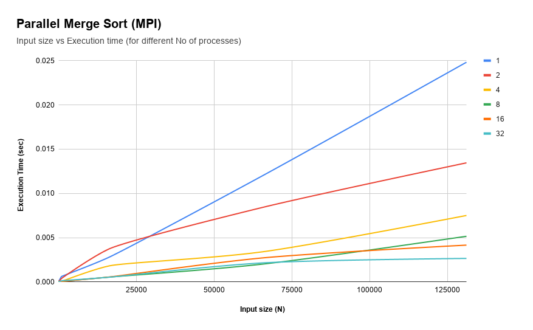

# Parallel Computing 
Parallel Merge Sort in MPI 
* * *

**Problem Statement:**

Parallel merge sort starts with n/comm_size keys assigned to each process. It ends with all the keys stored on process 0 in sorted order. To achieve this, it uses the same tree-structured communication that we used to implement a global sum. However, when a process receives another process’ keys, it merges the new keys into its already sorted list of keys. Write a program that implements parallel mergesort. Process 0 should read in n and broadcast it to the other processes. Each process should use a random number generator to create a local list of n/comm_size ints. 

Each process should then sort its local list, and process 0 should gather and print the local lists. Then the processes should use tree-structured communication to merge the global list onto process 0, which prints the result. (MPI)

### **Solution Approach:**

Merge Sort is a Divide and Conquer algorithm. It divides the input array into two halves, calls itself for the two halves, and then merges the two sorted halves. The merge() function is used for merging two halves. The merge(arr, l, m, r) is a key process that assumes that arr[l..m] and arr[m+1..r] are sorted and merges the two sorted subarrays into one.

Time Complexity (using serial implementation): Merge Sort is a recursive algorithm and time complexity can be expressed as the following recurrence relation. ** T(n) = 2T(n/2) + θ(n)**

The solution of the recurrence is **θ(nLogn). **

Here in this particular problem we have sorted lists at individual processes. these processes send the data to the other corresponding process, the other process on receiving the data merges its own sorted data with the received sorted data, resulting into a sorted array of 2N length (assuming the process array and received array are of size N). this process continues until the final parent process receives all the data. 

**fig1.1: merge sort merging operation**

Using parallel programming concepts we can divide our bigger problem into a smaller problem, and the smaller individual problem can be assigned to a single core/processor, here we use MPI to achieve parallel execution. Here we are doing Multiprocessing.

### Parallel Version of Merge sort:

### 

fig1.2: Message passing pattern

Using the same tree-structured communication that we used to implement a global sum.Here, when a process receives another process’ keys, it merges the new keys into its already sorted list of keys. and then passes it to other processes. The steps required in such a pattern are 

**log2( No. of Processes ).** For example 8 processes will require 3 steps. using this data we can build an algorithm that use MPI’s send and receive calls to do message passing between processes. The final result is printed by process 0.

**Problems Encountered :**

* **Concurrent Writes,** When using multiprocessing, having multiple processes writing to the same result file/stream, there were synchronisation issues, like one process was writing to a file and at the same time, another parallel process was also writing to the same location.

**To solve this**, Typically allow only one process at a time to print/write the data. 

* **Data Replication** of unused data into processes, since we used multiprocessing, where each process has to keep the whole data. One possible solution would be to keep data in chunks, and a process would be given data from its particular chunk. Another approach I used was to free the resources whenever the are not needed using **free(ptr).**

## Testing for sample Input (Correctness):

**How to run?**

$ mpic++ send.cpp -o send

$ mpirun -np 4 ./send

**Program output:**

### 

fig 2.1: program output

fig 2.2: program output

### **Results:**

	

Comparing the running time of the sequential program with the running time of the parallel program and computing the speedup for different array sizes..

The execution time of the problem decreases with increasing the no. of processes, however after increasing the treads count by a certain number of threads, there is no significant improvement in execution time. This is limited by no of cores in CPUs where the processes can run.

<table>
  <tr>
    <td>Results on machine:
Intel(R) Core(TM) i5-8250U CPU @ 1.60GHz
CPU(s): 8
Thread(s) per core: 2</td>
  </tr>
</table>

### **Comparisons:**

**Program Run Time** v/s **No of Processes **v/s **Input Size**

Fig3.1: General Execution Time Pattern

fig3.2: Exec time for Larger Data Size

fig3.3: Exec time for smaller data size

**All the graphs are based on the below table:**

**Input Size ->**

<table>
  <tr>
    <td>No of Process</td>
    <td>8</td>
    <td>10</td>
    <td>16</td>
    <td>32</td>
    <td>64</td>
    <td>128</td>
    <td>512</td>
    <td>1024</td>
    <td>16384</td>
    <td>65536</td>
    <td>131072</td>
  </tr>
  <tr>
    <td>1</td>
    <td>0.000008</td>
    <td>0.000002</td>
    <td>0.000013</td>
    <td>0.000022</td>
    <td>0.000031</td>
    <td>0.000079</td>
    <td>0.000327</td>
    <td>0.000615</td>
    <td>0.002808</td>
    <td>0.011991</td>
    <td>0.024824</td>
  </tr>
  <tr>
    <td>2</td>
    <td>0.000043</td>
    <td>0.000012</td>
    <td>0.000048</td>
    <td>0.000055</td>
    <td>0.000061</td>
    <td>0.000075</td>
    <td>0.000189</td>
    <td>0.000396</td>
    <td>0.003747</td>
    <td>0.008416</td>
    <td>0.013455</td>
  </tr>
  <tr>
    <td>4</td>
    <td>0.000019</td>
    <td>0.000027</td>
    <td>0.00003</td>
    <td>0.000032</td>
    <td>0.000037</td>
    <td>0.000026</td>
    <td>0.000056</td>
    <td>0.000062</td>
    <td>0.00182</td>
    <td>0.003402</td>
    <td>0.007509</td>
  </tr>
  <tr>
    <td>8</td>
    <td>0.000027</td>
    <td>0.000021</td>
    <td>0.000024</td>
    <td>0.000025</td>
    <td>0.000027</td>
    <td>0.000026</td>
    <td>0.000039</td>
    <td>0.000058</td>
    <td>0.000549</td>
    <td>0.002011</td>
    <td>0.005159</td>
  </tr>
  <tr>
    <td>16</td>
    <td>0.000027</td>
    <td>0.000021</td>
    <td>0.000026</td>
    <td>0.000031</td>
    <td>0.000027</td>
    <td>0.000031</td>
    <td>0.000055</td>
    <td>0.000061</td>
    <td>0.000561</td>
    <td>0.002713</td>
    <td>0.00416</td>
  </tr>
  <tr>
    <td>32</td>
    <td>0.000027</td>
    <td>0.000021</td>
    <td>0.000026</td>
    <td>0.000039</td>
    <td>0.00004</td>
    <td>0.000044</td>
    <td>0.000055</td>
    <td>0.000133</td>
    <td>0.000536</td>
    <td>0.002149</td>
    <td>0.002658</td>
  </tr>
</table>

Table: Execution time, No of processes, Input size

#### **Speedup comparisons:**

Comparing speedup vs no. of threads for different sizes of data. For large datasets parallel computing usually performs better.

fig4.1: speedup for various data size (different no. of processes)

fig4.2: speedup for various data size (different no. of processes)

### Observations:

* For CPU(s) with 8 cores and Thread(s) per core: 2, the best results were given by taking        **4 processes.** 

* The speedup for data sizes > 100 were above 2, that is the execution time for those problems were reduced by more than half, which is a **significant improvement**.

* As we increase the no. of processes the execution time again **starts to increase**, that is usually due to many processes being standing idle, waiting for a cpu burst, and the cpu can only process a certain no. of processes simultaneously.

* For Smaller data sizes the **speedup us below 1,** that is in case of smaller datasets it is better to use non parallel approaches, because the time for inter process communication becomes a significant factor here. 

### * * *

